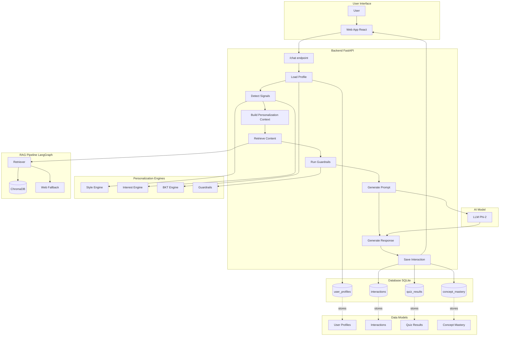

# NCERT Personalization Engine Architecture

## 1. Overview

The NCERT Personalization Engine is a sophisticated learning platform designed to provide a personalized educational experience for students using the NCERT curriculum. It's a web application with a FastAPI backend that leverages a combination of a Retrieval-Augmented Generation (RAG) pipeline, several personalization engines, and a Large Language Model (LLM) to deliver tailored responses to student queries.

## 2. Core Components

The application's architecture is modular, with several key components working together.

### 2.1. FastAPI Backend

The core of the application is a backend server built with FastAPI. It exposes a RESTful API for all functionalities, including user profile management, chat interactions, and quiz submissions. The main application logic resides in `main.py`.

### 2.2. SQLite Database

A SQLite database (`ncert_tutor.db`) is used for data persistence. It stores all user-related information, including profiles, interaction history, and mastery levels for different concepts. The database schema is defined and initialized in `main.py`.

### 2.3. Personalization Engines

The "intelligence" of the personalization lies in a set of four distinct engines:

*   **BKT Engine (`bkt_engine.py`):** The Bayesian Knowledge Tracing engine tracks each student's mastery of different topics. It uses a probabilistic model to update a student's knowledge state based on their quiz performance. This mastery level is used to adjust the difficulty of the content presented to the student.   

*   **Style Engine (`style_engine.py`):** This engine learns a student's preferred learning style over time. It analyzes both explicit keywords in queries and implicit behavioral signals (like dwell time and ratings) to build a "style vector" for each user. This vector determines the format of the response (e.g., use analogies, be brief or detailed).
       
*   **Interest Engine (`interest_engine.py`):** This engine gauges the student's current emotional and motivational state (e.g., frustrated, bored, engaged). It uses session data like ratings and follow-up questions to set flags that can alter the tone and content of the LLM's response.

*   **Guardrails (`guardrails.py`):** This is a safety layer that can override the suggestions of the other engines. It checks for off-topic questions, prevents jarring jumps in difficulty, and injects safety-oriented instructions into the LLM prompt.

### 2.4. RAG Pipeline (LangGraph)

The application uses a Retrieval-Augmented Generation (RAG) pipeline, orchestrated by LangGraph (`graph/pipeline.py`), to answer student queries.

*   **Retriever (`retriever.py`):**  When a query is received, the retriever searches a vector store (ChromaDB) containing the NCERT textbook content to find the most relevant information.
*   **Web Fallback:** If the retriever doesn't find a good match in the local corpus, it can fall back to a web search (using Tavily) to find an answer.

### 2.5. LLM Integration

A Large Language Model (LLM), such as Phi-2, is used to generate the final, human-like response. The `llm/llm_config.py` file manages the LLM configuration, allowing for switching between different models (local or cloud-based). The LLM is given a detailed prompt that includes the retrieved context and the personalization directives from the engines.

## 3. Data Models

The SQLite database contains several key tables:

*   **`users`**: Stores basic user information like `user_id`, `email`, and `name`.
*   **`user_profiles`**: Contains the personalization data for each user, including `grade`, `preferred_language`, and the `style_vector`.
*   **`interactions`**: Logs every query and response, creating a history of student interactions.
*   **`quiz_results`**: Stores the results of every quiz taken by a student.
*   **`concept_mastery`**: Stores the BKT parameters for each user and topic.

## 4. Request Flow (Chat Endpoint)

The following steps describe the process of handling a query to the `/chat` endpoint:

1.  **Load Profile:** The student's profile is loaded from the database. This includes their mastery scores from the BKT engine and their style vector.
2.  **Detect Signals:** The query text and recent user behavior are analyzed by the Style and Interest engines to determine the student's current needs and state.
3.  **Build Personalization Context (`pctx`):** A comprehensive context object is built, combining information from the profile and the detected signals.
4.  **Retrieve Content (RAG):** The RAG pipeline retrieves relevant content from the NCERT corpus or the web.
5.  **Run Guardrails:** The guardrails engine checks and potentially modifies the `pctx` to ensure a safe and effective response.
6.  **Generate Prompt:** A detailed prompt is constructed for the LLM, including the retrieved content and the personalization instructions from the `pctx`.
7.  **Generate Response:** The LLM generates a response based on the prompt.
8.  **Save Interaction:** The query, response, and a snapshot of the `pctx` are saved to the `interactions` table in the database. The Style and BKT engines are also updated based on this interaction.
9.  **Send Response:** The personalized response is sent back to the student.
